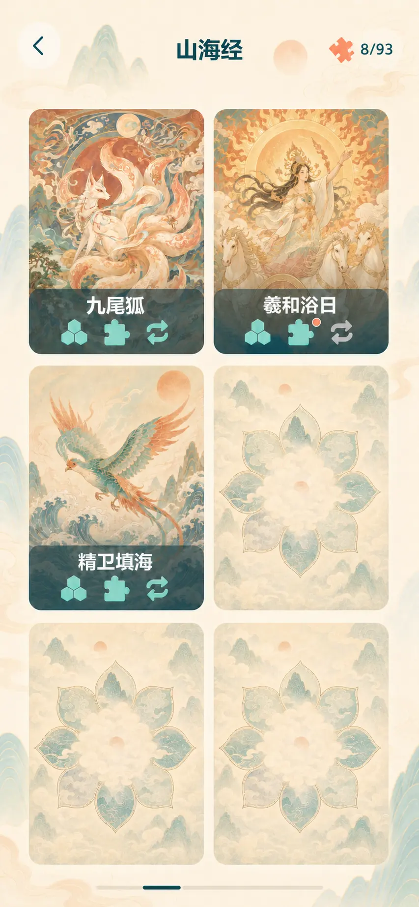
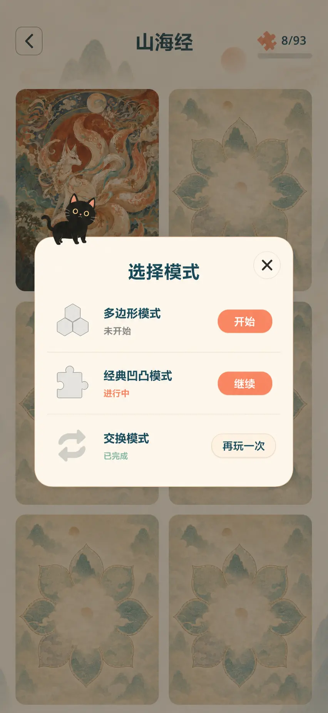
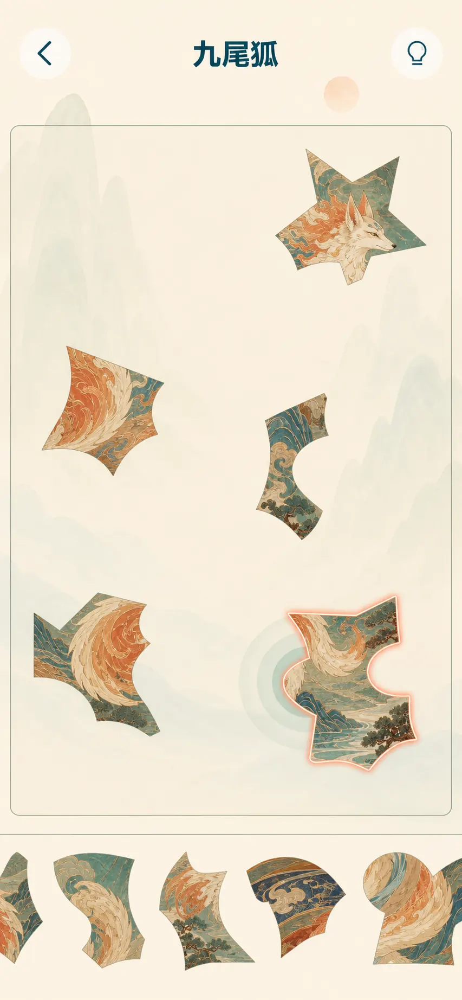
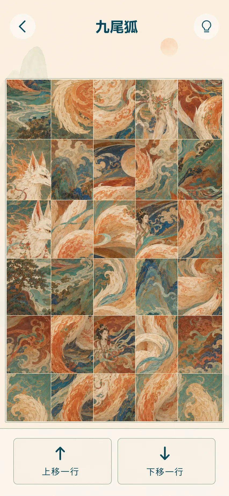
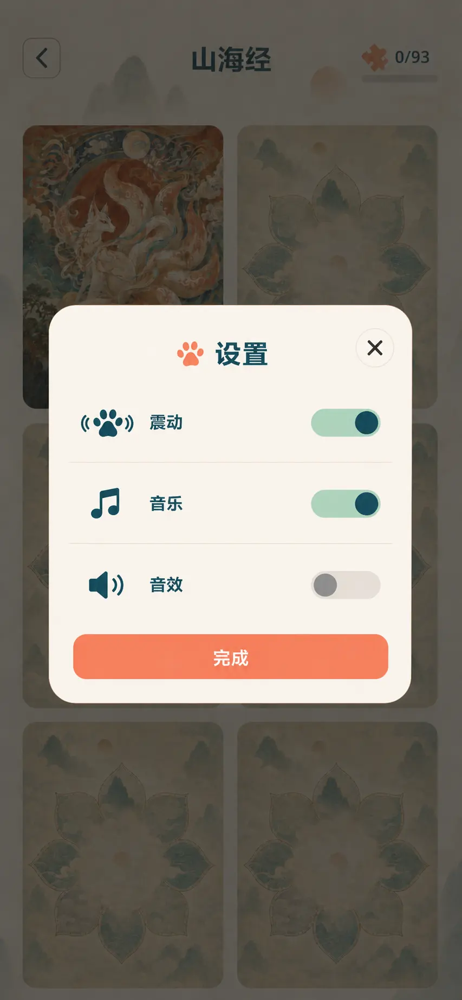
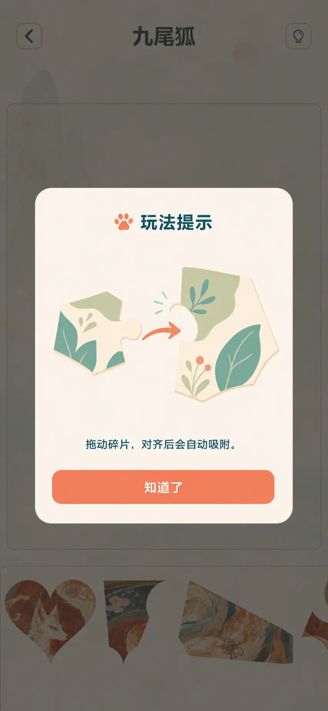
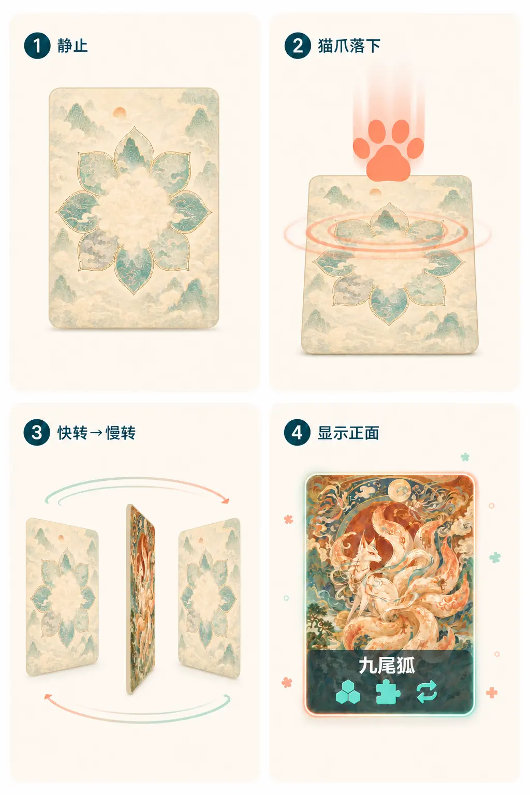

# JigCat 全局视觉与动效升级规范

## 目标

首页之外的界面统一使用新版 JigCat 视觉语言，保留主题差异，但不让每个弹窗和按钮形成一套独立样式。本轮覆盖关卡列表、模式选择、拼图 HUD、交换模式、设置、教程、完成展示、关卡解锁和页面动效；暂不处理声音。

## 视觉基线

| 用途 | 色值 |
| --- | --- |
| 深色文字、图标 | `#10475B` |
| 主按钮、重点状态 | `#F28A70` |
| 主按钮按下 | `#E9745E` |
| 页面暖雾底色 | `#FFF6E9` |
| 浮层表面 | `rgba(251, 250, 247, 0.94)` |
| 次级按下表面 | `#F2E9E1` |
| 成功、吸附反馈 | `#A8DCC6` |

- 全局只使用项目的现代圆角无衬线字体，不使用艺术字。
- 不使用皮革、布料、缝线、虚线外框、厚重金边和拟物阴影。
- 猫元素只作为克制的品牌标记：小爪印、铃铛或局部黑猫插画，不重复堆叠。
- 图形有语义：箭头只表示方向，锁定卡片不再额外显示锁图标。
- 所有文本先测量再布局；短标题缩放到安全字号，极长标题最多两行并使用省略号。

## 响应式规则

- iPhone 竖屏关卡页每页 `2 x 3` 张卡；iPad 竖屏每页 `3 x 3` 张卡。
- 关卡图片严格保持 `3:4`，不能拉伸或被文本挤压改变比例。
- 页面四周使用安全区；触控目标至少 `44 x 44 pt`。
- 弹窗宽度使用 `min(视口宽度 - 32pt, 560pt)`，内容过高时只滚动内容区，标题和主操作保持可见。
- 游戏拼图区维持原图比例并优先占用中部空间；托盘固定在底部，不侵入拼图区。
- 交换模式两个操作按钮等宽，间距 `16pt`，长文案允许缩小但不换成无意义缩写。

## 全局动效

- 普通按钮：按下 `90ms` 缩放至 `0.96`，松开 `150ms` 回到 `1.0`，使用 `quart-out`；文字不单独缩放。
- 页面切换：`220-300ms`，短距离位移配合交叉淡化；返回方向与进入相反。
- 弹窗：遮罩 `160ms` 淡入，面板从 `0.97` 到 `1.0`、透明度从 `0` 到 `1`，总时长 `220ms`。
- 吸附成功：碎片 `100ms` 轻收紧，边缘薄荷色光带 `180ms` 消散，不使用持续发光。
- 所有一次性入场只在首次显示时播放，滚动或重排时不重复表演。
- 开启“减少动态效果”后取消位移、旋转和回弹，只保留 `80-120ms` 淡入淡出或即时切换。

## 页面规范

### 1. 关卡列表

- 顶部使用圆形返回按钮、无框主题标题和拼图图标进度 `x/x`。
- 横向滑动分页，固定轨道上的高亮段按 `1 / 总页数` 计算宽度并连续移动；不使用分页圆点。
- 已解锁卡片底部使用轻透明信息带，显示关卡名称和三个现有模式图标。
- 模式已完成显示彩色图标，未完成显示灰色；进行中在图标右上角显示珊瑚色小圆点。
- 锁定卡片只显示当前主题的专属卡背，不显示锁图标、序号、条件和模式状态。
- 当前页和相邻页常驻，其他页按需创建，避免 20 页以上时一次构建全部卡片。
- 页切换 `280ms`，跟手拖拽；松手后不足阈值回弹，超过阈值吸附到目标页。

### 2. 模式选择

- 使用统一暖白面板，黑猫四脚站在面板左上边缘；不悬挂、不探头。
- 右上关闭按钮触控区至少 `44pt`。
- 三个模式纵向排列，以细分隔线分组，不使用三种彩色外框。
- 每行只显示一个操作：未开始“开始”、进行中“继续”、已完成“再玩一次”。
- 不显示原图，不提供“重新开始”，不使用方向箭头。
- 入场时标题先出现，三行以 `35ms` 间隔依次淡入；选择后按钮短促确认再进入游戏。

### 3. 拼图模式 HUD

- 顶部左侧圆形返回，中间无框关卡名，右侧圆形提示按钮。
- 拼图区只用细边界和极浅底色标明可拖拽范围，不做厚卡片。
- 托盘保持现有半透明风格并贴近底部，使用一条细分隔线与拼图区区分。
- 多边形和凹凸模式共享同一 HUD；缩放、拖拽和吸附逻辑不改变。

### 4. 交换模式

- 顶部和背景与拼图模式一致。
- 中部优先显示完整 `3:4` 交换网格。
- 底部操作带包含“上移一行”和“下移一行”两个等宽按钮，箭头和文案方向一致。
- 两个按钮使用同一色系和同一状态，不用颜色区分方向。
- 行移动 `220ms`，旧行向目标方向滑出，新行从另一侧进入；连续点击在动画结束前锁定。

### 5. 设置

- 与模式选择共用弹窗外形、标题字号、关闭按钮和底部主按钮。
- 列出震动、音乐、音效；图标需要重新制作并保持统一线宽。
- 开关使用深青轨道/暖白圆点，关闭状态降低对比度，不整行变灰。
- 开关切换 `160ms`，圆点平移并伴随轨道颜色过渡；减少动态效果时即时切换。

### 6. 教程

- 与设置共用弹窗组件；标题为“玩法提示”，仅使用一个小爪印标记。
- 每个玩法使用新的扁平插画说明实际操作，不继续使用旧的高饱和拟物图。
- 首次教程只保留一个“知道了”主按钮，不额外放关闭按钮。
- 示意动画最多循环两次后停在结果状态，避免永久循环。

### 7. 完成展示

- 使用全屏通透揭示，不使用居中的盒状完成弹窗。
- 背景模糊并覆盖暖色薄雾，中央放大显示清晰的 `3:4` 完整作品。
- 不显示“完成”“恭喜”等标题；作品下方显示名称、最多两行介绍和一个“确认”按钮。
- 周围只保留 `8-12` 个低透明拼图/圆形粒子，不使用射线、烟花、下落光条和纸屑堆。
- 动画：背景 `180ms` 变暗；作品 `360ms` 从 `0.94` 放大到 `1.0`；名称和介绍在 `120ms` 后淡入；按钮最后出现。

### 8. 关卡解锁

- 动画只发生在原关卡卡片位置，不进入全屏。
- 第一步：主题卡背静止。
- 第二步：珊瑚色猫爪从上方拍下，卡片压缩到 `0.96`，出现一次压力波纹。
- 第三步：卡片绕垂直轴转两圈；第一圈快、第二圈慢，在第一次最窄中点把卡背换成正面。
- 第四步：正面停稳，薄荷/珊瑚细描边扫过一次，周围出现 `5-7` 个近距离低透明粒子。
- 总时长约 `1.25s`；第一圈 `300ms`、第二圈 `520ms`、收尾 `280ms`。
- 删除火焰、燃烧、玻璃裂纹、碎裂、烟雾、金色射线和全屏遮罩代码。

## 代码职责

- 单个 GDScript 尽量不超过 `300` 行。
- 关卡分页、关卡卡片、顶部栏和分页指示器拆分为独立职责。
- 模式选择只管理模式状态和选择，不负责通用弹窗布局。
- 设置、教程、完成展示从旧 `GameDialogs.gd` 拆分为独立控制器；通用遮罩和面板由共享组件创建。
- 解锁时间线与粒子绘制分离，方便以后替换动画而不改关卡列表业务逻辑。
- 旧资源只有在 `rg` 确认无引用后才删除。

## 验收

- 使用真实目录数据，不注入 `cat_moon_01` 等测试关卡。
- 在 iPhone 与 iPad 竖屏尺寸运行正常窗口 Godot 测试。
- 覆盖首页、关卡分页、模式选择、两类游戏 HUD、设置、教程、完成展示和解锁中间帧截图。
- 没有越界、重叠、原始截断、重复输入、残留弹窗或切屏后旧状态。
- “减少动态效果”路径可用。
- 所有测试返回 `"ok": true` 且进程退出码为 `0`。
